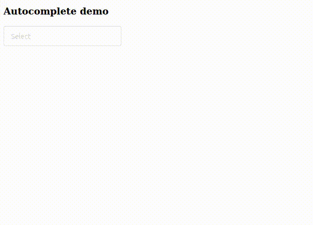

## Autocomplete Demo

### Setup
- Install dependencies using `pip install -r requirements.txt`
- Ensure Redis is running

### Run demo
- Start app using `uvicorn main:app --reload`
- Go to http://127.0.0.1:8000

